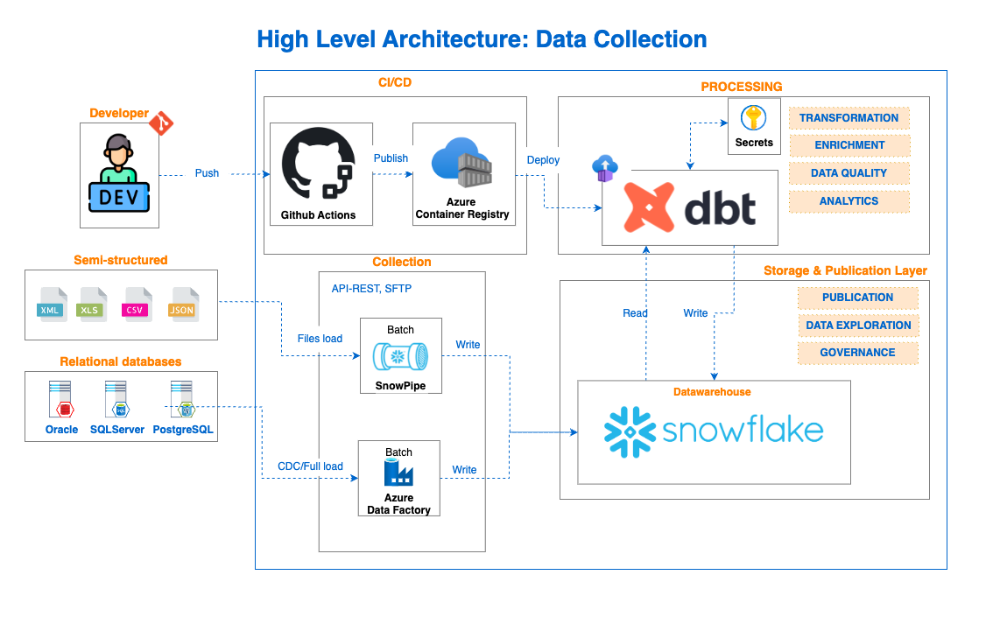
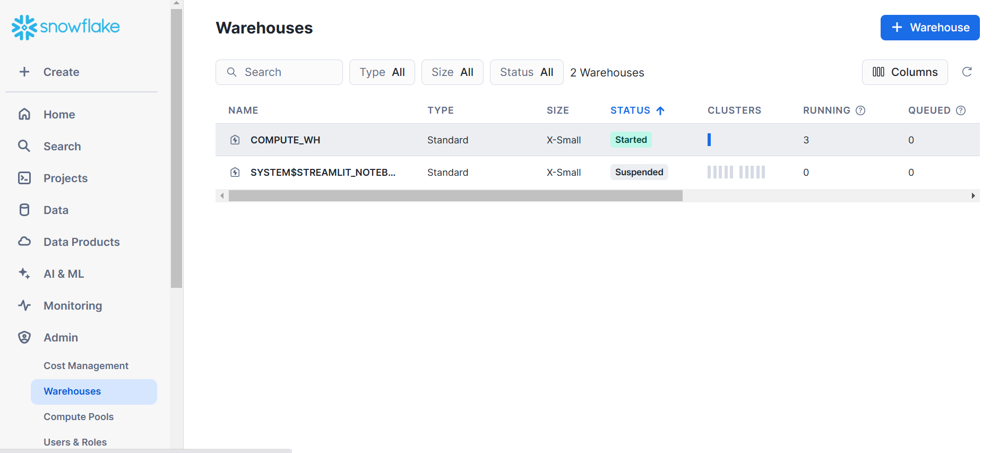
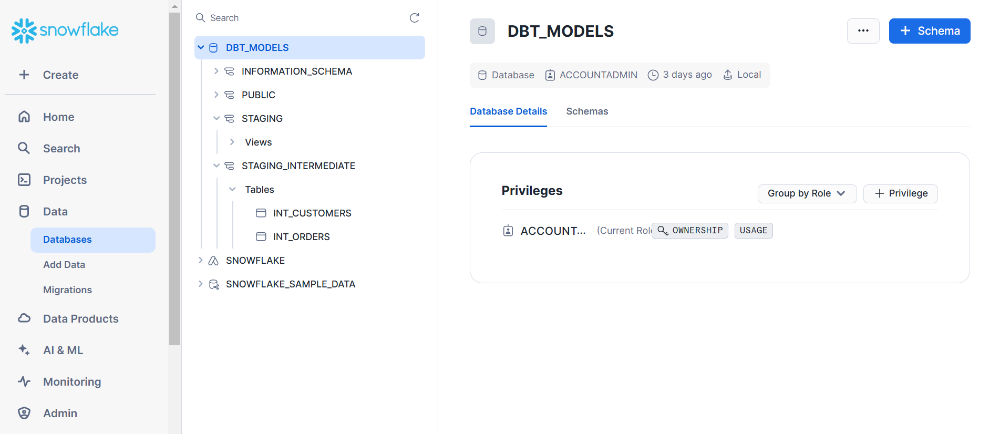
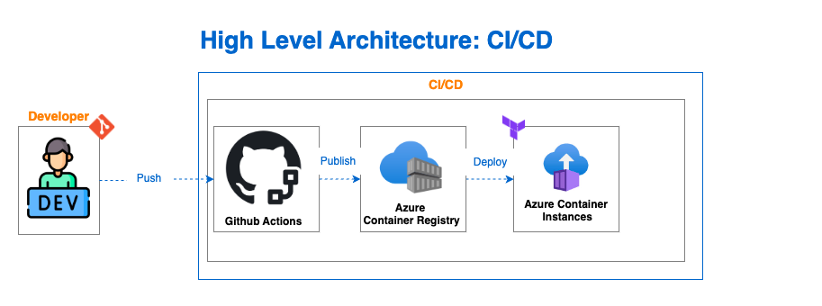
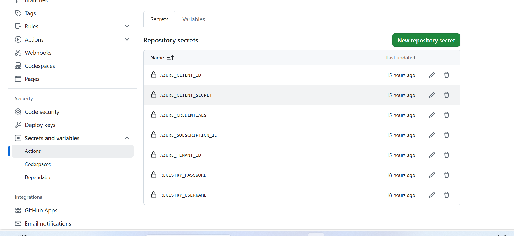

# Get Started with DBT (Azure, Snowflake Integration)

## Table of Contents
1. [Overview](#overview)  
2. [Architecture](#architecture)  
3. [Prerequisites](#prerequisites)  
4. [Project Structure](#project-structure)  
5. [Setup Guide](#setup-guide)  
    - [1. Authenticate with Azure](#1-authenticate-with-azure)  
    - [2. Terraform State Backend](#2-terraform-state-backend)  
    - [3. Initialize and Apply Terraform Configuration (Baseline)](#3-initialize-and-apply-terraform-configuration-baseline)  
    - [4. Deployment of ACI](#4-deployment-of-aci)  
    - [5. Snowflake Setup](#5-snowflake-setup)  
    - [6. Setup DBT](#6-setup-dbt)  
    - [7. GitHub Actions Setup](#7-github-actions-setup)  
6. [Troubleshooting Issues](#troubleshooting-issues)  
7. [References](#references)  
8. [Conclusion](#conclusion)  

## Overview
This repository configures an Azure-based environment for running *DBT* (Data Build Tool) with *Snowflake*. It includes infrastructure automation using *Terraform* and a *CI/CD pipeline* for deploying DBT transformations. The setup uses Snowflake sample tables *CUSTOMERS* and *ORDERS* for transformation exercises.

> **Note:**  
> 1. These steps were executed on a Windows machine. Adjust commands or scripts accordingly for other operating systems.  
> 2. Integration with ADF to collect data from external sources will be updated later (main focus is on exploring DBT and its capability with Snowflake integration).

## Architecture
<p align="center">
  
</p>

## Prerequisites
Before setting up this project, ensure you have the following installed in your local or virtual environment (whichever preferred):

- [Azure CLI](https://learn.microsoft.com/en-us/cli/azure/install-azure-cli)
- [Terraform](https://developer.hashicorp.com/terraform/tutorials/aws-get-started/install-cli)
- [Docker](https://docs.docker.com/get-docker/)
- [DBT](https://docs.getdbt.com/docs/core/installation-overview) 
- [Snowflake Account](https://signup.snowflake.com/)
- OpenSSL (Required for key-pair generation) - Install from [OpenSSL](https://slproweb.com/products/Win32OpenSSL.html) (for Windows)

## Project Structure
```
├── baseline/                 # Terraform configuration for foundational infrastructure
├── infra/                    # Terraform configuration for Azure Container Instances
├── tpch_transform/           # dbt models for transformations
├── .github/workflows/        # CI/CD workflows for deployment
└── README.md                 # This documentation
```
## Setup Guide

### 1. Authenticate with Azure
Run the following command to authenticate with Azure:
```sh
az login
```
Ensure you have the correct Azure subscription selected:
```sh
az account set --subscription <subscription-id>
```

### 2. Terraform State Backend

To set Infrastructure through Terraform, must execute code in the *baseline* folder to deploy Resource groups, Azure Key Vault and Azure container Registry. 
Terraform stores its state in an Azure Storage Account. Hence must have a storgae account for *terraform init* to succeed. If the storage account does not exist, create it manually or automate the creation.

### 3. Initialize and Apply Terraform Configuration (Baseline)
If the storage account does not exist, you need to create it manually or automate the creation.

#### 3.1 (OPTION 1) - Manual Creation of Storage Account and Container
Create Storage Account and Container either Azure CLI script or Azure Portal 
```sh
az group create --name az-uks-syn-pract-cloud-baseline-rg01-pro --location uksouth
```
```sh
az storage account create --name azukssynbasstategsa01pro --resource-group az-uks-syn-pract-cloud-baseline-rg01-pro --location uksouth --sku Standard_LRS
```
```sh
az storage container create --name tfstate --account-name azukssynbasstategsa01pro
```
Then execute the below 2 commands successfully in baseline folder
```sh
terraform init
```
The optional command to check what resources going to deployed and track changes use below command
```sh
terraform plan
```
```sh
terraform apply
```
#### 3.2 (OPTION 2) - Automate Creation of Storage Account and Container 
To automate creation of Storage Account and Container execute *terraform init* and *terraform apply* successfully once without backend references (backend.tf file in both baseline and infra folders and also *terraform_remote_state* resource in *infra* folder. Execute first in *baseline* folder and then in *infra* folder after set up key pair as mentioned in next section 3.3)

Terraform initialized by executing below command:
```sh
terraform init
```

Then, apply the Terraform configuration:
```sh
terraform apply
```
#### 3.3 SNOWFLAKE KEY
After deploying the baseline, the next step is to create a secret in Key Vault for the Snowflake key. This requires generating a key in Snowflake by following this [guide](https://docs.snowflake.com/en/user-guide/key-pair-auth). Once the key is created, convert it to Base64 using the following command and then and store it as a secret in Azure Key Vault.

```sh
base64 -i snowflake_dbt.p8
```
#### 3.4 Deployment of ACI
The ACI deployment uses the code in the *infra* folder, keeping baseline infrastructure separate from development. Any dbt code changes trigger only relevant resource updates. The container image for deployment is passed as a variable, handled seamlessly in the *CI/CD pipeline*.
Execute the below 2 commands successfully in infra folder
```sh
terraform init
```

Then, apply the Terraform configuration:
```sh
terraform apply 
```
Use environment variable image_version=latest when prompts.

#### 3.5 (OPTIONAL) Build and Push Docker Image
In case of issues with docker image inaccessible or similar try the below commands to build/pull a dbt image and push to ACR
Authenticate to the Azure Container Registry (ACR):
```sh
az acr login --name <acr_name>
```
Build the Docker image:
```sh
docker build -t <acr_name>.azurecr.io/dbt/tpch_transform:latest .
```
Push the image to ACR:
```sh
docker push <acr_name>.azurecr.io/dbt/tpch_transform:latest
```

### 5. SNOWFLAKE SET UP
After deploying the infrastructure, we configure Snowflake by setting up an account and creating a warehouse for the demo. The dataset used for transformations is *tpch_sf1*, specifically the *customer* and *orders* tables. For this demo, we use the *COMPUTE_WH* warehouse, which will be configured in dbt.

<p align="center">
  
</p>

To store transformed data, we create a new database called *DBT_MODELS* with two schemas: *staging* and *staging_intermediate*. The staging schema cleans raw data, retaining only relevant columns. The staging_intermediate schema applies business logic to the cleaned data, creating refined datasets. This final layer serves as the foundation for visualization tools or data analysis by data scientists.

<p align="center">
  
</p>

Then generate a certificate in snowflake to connect from our DBT application, to follow this [guide](https://docs.snowflake.com/en/user-guide/key-pair-auth)

### 6. Setup DBT 
DBT (Data Build Tool) is a powerful data transformation tool that enables data teams and analysts to efficiently manage, transform, and document data within their data warehouses. Built for SQL users, DBT streamlines development, testing, and deployment through a code-driven and collaborative workflow. Since DBT runs transformations within the data warehouse, it doesn’t consume additional processing resources. It also supports various connectors for leading platforms like Snowflake, BigQuery, and Redshift.

DBT allows developers to create reusable configurations and modular SQL-based transformations. One of its key strengths is its seamless integration with CI/CD tools, ensuring best practices in data development.

For this demo, we use the code in the *tpch_transform* folder and review key configurations. The *dbt_project.yml* file is a crucial component, guiding DBT on how to handle models. Models in DBT represent tables or views in the data warehouse and are defined using SQL files. They are the building blocks of data transformations, making data organization and structuring more modular and reusable.

A key aspect is how we persist model data in Snowflake. In the staging schema, data is stored as views, while in the intermediate schema, it is saved as final tables.

Another crucial file is *profiles.yml*. This configuration file defines the database connection profiles that DBT uses to run transformations. It allows DBT to connect to different environments (development, testing, production) while managing credentials and configurations for each. In this case, the configuration is set up to connect to Snowflake.

This example includes two profiles: one for development and another for production. Each profile defines the connection details, warehouse, role, user credentials, and additional settings like timeout and the default schema for persisting data if none is specified in the model.

To build the image, we use the Dockerfile, which is based on Azure's provided image (Check section 3.5 above for commands if any errors/issues). It also installs required libraries and the application to enable execution.

Lastly, we have the *entrypoint.sh* configuration file, which will be used once the image is uploaded. This script not only runs DBT but also retrieves the Snowflake certificate by connecting to the key vault. It first obtains a connection token using the container instance's profile, then retrieves the *snowflake_certificate* secret, which is set as an environment variable in the container's infrastructure.

In the transformation section, we will focus on the *models* folder, where the transformation logic is defined. It contains two models: staging and intermediate. The staging model simply reads from the *orders* and *customers* tables to generate two views. The view definitions are found in the *schema.yml* file, while the connection to the source tables is outlined in the *stg_sources.yaml* file. The other two *.sql* files contain the logic for selecting specific fields from these tables and creating new views with defined aliases.

In the intermediate model, the structure is similar, but there is no need to reconnect to the source tables, as this connection has already been established in the staging model. The *.sql* files contain the logic for performing joins and other operations between the tables from the staging model.

(Optional) Activate the Python virtual environment:
```sh
.\dbt_env\Scripts\activate   # Windows PowerShell
```
Run dbt transformations:
```sh
dbt run
```

### 7. Github Actions setup

GitHub Actions is a workflow automation platform that enables developers to automate software development tasks within their GitHub repositories. It allows users to define custom workflows triggered by events like commits, pull requests, releases, and more.

The high level architecture is:

<p align="center">
  
</p>

For this demo, we've created a flow that triggers the GitHub Action whenever a new commit is made to the main branch. This GitHub Action consists of two stages: First, it builds and publishes the image to the Azure Container Registry by logging into Azure using credentials stored on GitHub. The second stage deploys the infrastructure, using the code from the folder mentioned earlier. During infrastructure deployment, we pass the version of the image we built earlier as a variable.

Here’s the configuration of the secrets we set up:

<p align="center">
  
</p>

To create AZURE_CREDENTIALS secret use below command
```sh
az ad sp create-for-rbac --name "terraform-sp" --role Contributor --scopes /subscriptions/<SUBSCRIPTION_ID> --sdk-auth
```
Refer .github section for exact configuration for Github Actions

### 7. Troubleshooting Issues
#### a. Docker Engine Error on Windows
If you encounter an error related to Docker Desktop Linux Engine:
```sh
error during connect: Get "http://%2F%2F.%2Fpipe%2FdockerDesktopLinuxEngine/..."
```
Ensure Docker is running in Windows mode:
1. Open Docker Desktop
2. Switch to Windows containers if necessary

#### b. Terraform Storage Backend Not Found
If you see a 404 error related to the storage backend:
```sh
Error: retrieving Storage Account... unexpected status 404
```
Ensure the storage account is created by running:
```sh
terraform apply -auto-approve -target=azurerm_storage_account.storageaccount
```

#### c. DBT Command Not Found
If running `dbt run` results in an error:
```sh
'dbt' is not recognized as an internal or external command
```
Ensure dbt is installed and activated in the virtual environment:
```sh
pip install dbt-core dbt-snowflake
source dbt_env/bin/activate  # macOS/Linux
```

#### d. Snowflake Authentication Issues
If you receive an error like:
```sh
Password was not given but private key is encrypted
```
Ensure you have set up the private key correctly:
```sh
openssl genrsa -out rsa_key.pem 2048
openssl rsa -in rsa_key.pem -pubout -out rsa_key.pub
```
Use the public key in Snowflake user settings.

#### e. Useful Commands

# Apply Terraform with specific variable
```sh terraform apply -auto-approve -var='image_version=${image_version}'```

# Initialize Terraform with migration
```sh terraform init -migrate-state```

# Apply Terraform for a specific resource
```sh terraform apply -target=azurerm_resource_group.rg -auto-approve```

# List Azure Container Registries in a specific resource group
```sh az acr list --resource-group az-uks-syn-pract-cloud-baseline-rg01-pro --output table```

# Login to Azure Container Registry
```sh az acr login --name dbtjobs```

# Build a Docker image
```sh docker build -t dbtjobs.azurecr.io/dbt/tpch_transform:latest .```

# Activate Python virtual environment (Windows PowerShell)
```sh dbt_env\Scripts\activate```

# Set PowerShell execution policy to allow script execution (if needed)
```sh Set-ExecutionPolicy -ExecutionPolicy RemoteSigned -Scope CurrentUser```

# Retrieve Azure Container Registry username
```sh az acr credential show --name dbtjobs --query "username" --output tsv```

# Retrieve Azure Container Registry password
```sh az acr credential show --name dbtjobs --query "passwords[0].value" --output tsv```


## References
- [DBT Documentation](https://docs.getdbt.com/docs/introduction)
- [Terraform Azure Provider](https://registry.terraform.io/providers/hashicorp/azurerm/latest/docs)
- [Azure Container Registry](https://learn.microsoft.com/en-us/azure/container-registry/)
- [Snowflake Setup](https://docs.snowflake.com/en/user-guide/admin-security-fed-auth-use)

## Conclusion
This guide provides step-by-step instructions to set up and deploy dbt on Azure with Terraform and Snowflake. Follow the troubleshooting steps to resolve common issues. For further improvements or issues, feel free to raise a GitHub issue.

---
_Last updated: March 2025_
